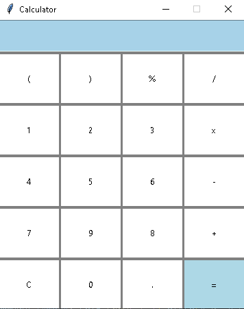

# Calculator Application

### Overview
This Python application is a simple calculator built using the Tkinter library. It provides basic arithmetic operations, including addition, subtraction, multiplication, and division

## Features
* User-friendly graphical user interface (GUI).
* Supports addition, subtraction, multiplication, and division.
* Clear entry field for input and result display.
* Easy-to-use buttons for number input and operations.
* Clear button to reset the input field.
* Calculates and displays results instantly.
* Handles basic error checking for invalid expressions.

## Installation
1. Clone the repository to your local machine:
[HERE](https://github.com/VVShore/Calculator.git)
2. Navigate to the project directory
3. Run applicaiton
## Usage
- Enter numeric values and basic operators to build your expression in the input field.
- Click the "=" button to calculate and display the result.
- Use the "C" button to clear the input field.
- The calculator handles basic error checking for invalid expressions.
## Dependencies
- Python
- Tinker(in-built)

## Credits
[Vincent Ho](www.linkedin.com/in/vphuho)- Developer